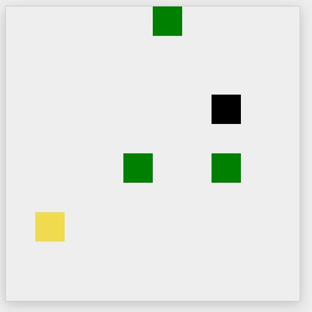

# Jogo-MultiPlayer-JavaScript
Aplicação desenvolvida afim de mostrar um pouco sobre arquitetura de software através de um jogo MultiPlayer simples.

# Objetivo
Foi Utilizado o Canvas para "Desenhar" um Quadrado, onde existem pixels coloridos dentro do mesmo que se movem ao precionar as teclas de setas do teclado na direção das mesmas.
O pixel amarelo representa o seu jogador, os pixels verdes representam as "Frutas" a serem coletadas assim que haver uma colisão entre algum jogador e a Frutinha, o pixel colorido
de preto representam seus adversários. O objetivo do Jogo é coletar mais Frutas possíveis.

# Execução do Projeto
Basta Simplesmente na pasta raiz deste projeto, onde se encontra o arquivo package.json, abrir o Prompt de Comando se estiver utilizando o Windows, ou o Terminal
se estiver utilizando Linux e executar o comando a seguir: `npm install && node server.js`,  este comando fará o Node baixar as dependências do projeto e logo
em seguida servir a aplicação no endereço `localhost:3000`. Pronto já poderá acessar e ao acessar será inicializado o Socket.Io que mencionarei mais abaixo,
e já lhe conferirá um pixel amarelo que lhe representará como um Player no Jogo, como o mesmo é MultiPlayer, pode-se compartilhar essa URL com seus amigos e logo verá outros 
jogadores com você no Game, porém lembre-se como a aplicação está local, terá que trocar o `localhost` por seu endereço de IP local. Observação importante, este projeto
utiliza uma das funcionalidades do EcmaScript 6+, que são os Módulos, dentre outras, logo é necessário que esteja em sua máquina instalado de preferência a última versão LTS do NodeJS,
ou as versões que já suportam essas recentes feactures do JavaScript.

## Design Patterns Envolvidos

### Factory
Foi Utilizado o Pattern Factory, afim de otimizar algumas funcionalidades, o conceito que este Pattern traz consigo em síntese é lhe servir de forma automatizada uma
instância de um Objeto passando ou não algum parâmetro, simples porém muito útil, foi utilizado afim de isolar alguns recursos e auxiliar nas estratégias de regra de negócio.

### Observer
Para entender melhor o Conceito que o Observer traz, imagine que esteja jogando este jogo, por o mesmo ser MultPlayer, várias camadas do sofware terá que ter ciência de quando um jogador
será conectado ou desconectado, ou haverá a colisão do mesmo com alguma fruta e etc afim de renderizar o estado atual do jogo novamente no Browser, sem esse Pattern, bem provavelmente
que para se resolver estas situações o software iria sofrer de uma das maiores "doenças" que um software poderia ter que é o acoplamento, ou o levantamento de esforço para se manter tudo atualizado
seria muito maior, pois imagine 10 jogadores conectados, todos devem saber quando algum se mover, ou se desconectar e etc. Para não me estender muito na explicação deste Pattern recomendo caso
tenha curiosidade ler este artigo da DevMedia `https://www.devmedia.com.br/design-patterns-observer/16875`. 

## Implementações e Tecnologias Envolvidas

### SocketIO
Utilizado o SocketIO afim de implementar o Padrão WebSocket, padrão utilizado em grandes projetos como Twitter, Whatsapp e vários outros.
O conceito que o WebSocket traz é oriundo de trocas de mensagens em dupla direção, Cliente e Server o Front-End e Back-End, como queira adotar,
diferentemente dos verbos HTTP, como: GET onde se é necessário realizar tal requisição ao Server afim de obter alguma mensagem e após a obtenção
da mesma a conexão é encerrada, no WebSocket o próprio Server já lhe envia tal através do mesmo que utiliza o protocolo TCP para se comunicar
logo existe uma comunicação bidirecional e o mais importante a conexão uma vez feita não é encerrada, é criado um "tunel" onde as informações são 
trafegadas, desta forma o fluxo de informações fica o mais próximo possível do tempo real.  A capacidade bidirecional é tão boa que se pode tunelar
um protocolo TCP de tempo real, como Remote Desktop ou VNC, sobre um WebSocket.

## Express
Express é um para o NodeJS, o mesmo cria abstrações de rota, funções middleware e etc. Neste Projeto o mesmo foi utilizado juntamente com o Socket.IO
